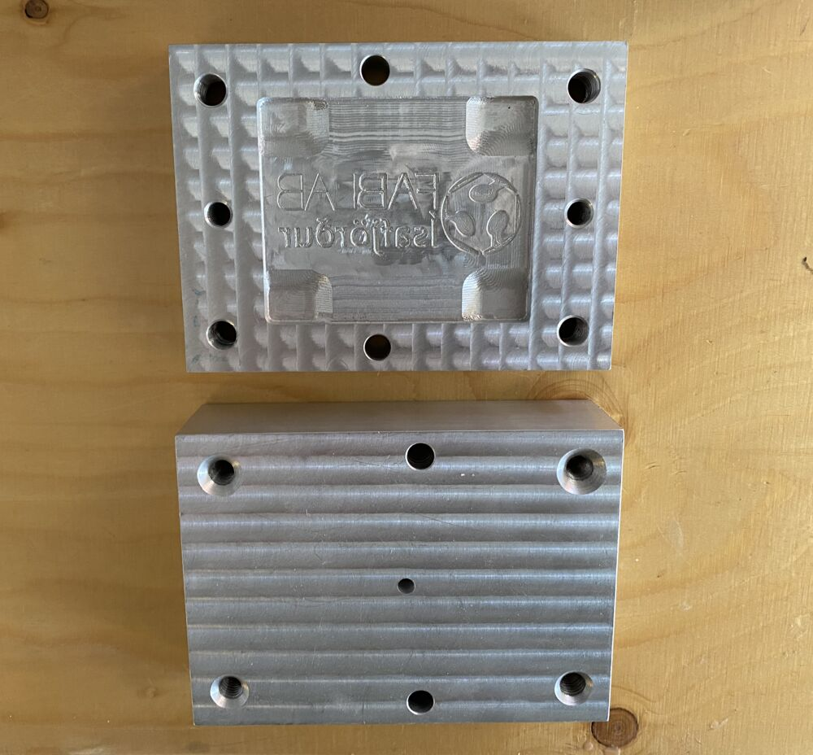
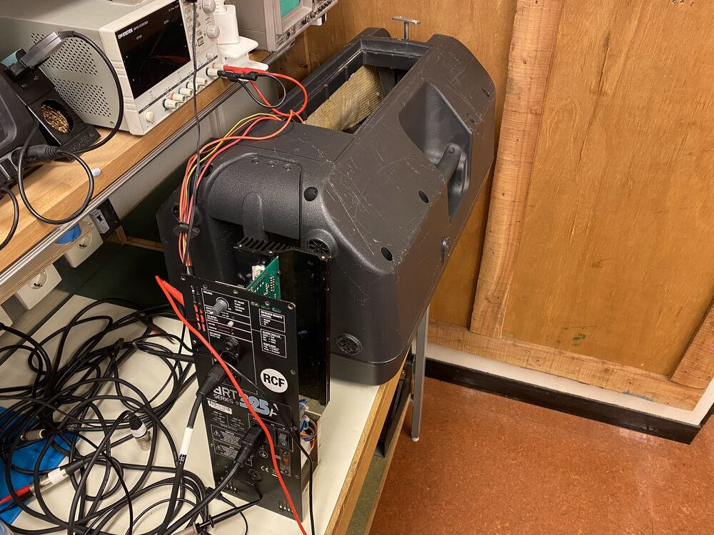

## System integration tips from Fab Lab Ísafjörður

Here are a few tips that might be useful for [System integration week](http://academy.cba.mit.edu/classes/system_integration/index.html) in the [Fab Academy](https://fabacademy.org/):

### Cable management
[Svavar](https://fabacademy.org/2023/labs/isafjordur/students/svavar-konradsson/) demonstrates how you can embed mesh fabric into 3D prints and make a cable carrier:

<a href="https://fab.cba.mit.edu/classes/865.24/people/svavar/components/cable_carrier/"><video autoplay="true" loop="true" src="https://fab.cba.mit.edu/classes/865.24/people/svavar/components/images/cable_carrier/cable_carrier.mp4" title="3D printed cable carrier" width="500"></video></a>

Links from [Cedric Honnet](https://honnet.github.io/):

"Cables can be protected by [articulated](https://www.amazon.com/Plastic-Machine-Carrier-Ted-Lele/dp/B074S2GQ56/?th=1), [braided](https://www.amazon.com/Keco-100ft-Expandable-Braided-Sleeving/dp/B07K1WP871?th=1) or [hybrid wrappers](https://www.amazon.com/Management-Diameter-Organizer-Expandable-Concealer/dp/B07PPR47ZV/?th=1)".

[Vineet Padia](https://vineetpadia.github.io/about.html) has mentioned [a way to document wiring harnesses](https://github.com/wireviz/WireViz).

It's good for students to know that [pogo pins](https://youtube.com/shorts/ujPLo5TwJpo?si=bV2MN7eU0-r7oVI-) and [slip rings](https://www.electrical4u.com/slip-ring/?utm_content=cmp-true) exist.

### Packaging

A nice example of the importance of packaging:
<table style="width:100%">
  <tr>
    <td>Virtual detents were developed by Jesse Schoch:
    
    <a href="https://youtu.be/1gPQfDkX3BU?si=Nw4lrJQ-mKGDoMy1&t=859"><video autoplay="true" loop="true" src="virtual_detents.mp4" title=""></video></a>
    </td>
    <td>But the method didn't become popular until it was packaged as the SmartKnob by Scott Bezek:

    <a href="https://youtu.be/ip641WmY4pA?si=FMXZIBXmvUoXk3_i"><video autoplay="true" loop="true" src="smartknob_detents.mp4" title=""></video></a>
    </td>
  </tr>
</table>

[Árni Björnsson](https://fabacademy.org/2022/labs/isafjordur/students/arni-bjornsson/)'s final project reveals everything with a transparent enclosure:

Wires hidden inside the structure of an LED-studded dress and integrated button, by [Hafey Hallgrímsdóttir](https://fabacademy.org/2023/labs/isafjordur/students/hafey-hallgrimsdottir/):

[The work that comes after the first rough prototype](https://youtu.be/caYl8u7Gd0A?si=M49v6m-484e8k_2f) 

### Nice prototyping

[Quote](https://makezine.com/article/digital-fabrication/machining/18-lessons-smart-prototyping-self-made-billionaire/) from Dan Gelbart:
>I cannot overemphasise the importance of making everything with keyholes and slots and captive hardware. If you spend all your life in R&D you’ll spend about one year of your life taking screws out of covers, so if you do it in slots, it’s the same as extending your life by the same amount of health food plus exercise extends your life, and it’s much simpler.

Dan Gelbart's classic notes on quick prototyping: [Part 1](https://people.ece.ubc.ca/leos/pdf/tools/machine/DGCourseNotes.pdf), [Part 2](https://people.ece.ubc.ca/leos/pdf/tools/machine/DGCourseNotes2.pdf)

Dan says that you can prototype just about anything with a [waterjet cutter](https://wazer.com/) (because it cuts through any material with good precision), a [press brake](https://en.wikipedia.org/wiki/Press_brake) and some welding tools. Take a look at the examples in his notes, they're fantastic.

### Documentation

Good ways to document electronics on a website:
- [InteractiveHtmlBom](https://github.com/openscopeproject/InteractiveHtmlBom)
- [Kicanvas](https://kicanvas.org/) (still in alpha, but you can [embed](https://kicanvas.org/embedding/) KiCAD files on a web page)

### Food projects

[Food safe design principles](https://www.meatinstitute.org/sites/default/files/original%20documents/Sanitation%20booklet%202021.pdf):

- Inert materials
- Simple shapes that are easy to clean
- Smooth surface finish
- No crevices where water collects and bacteria can grow)

### Design for safety

<table style="width:100%">
  <tr>
    <td>Safety features: A colleague at an Icelandic company put two buttons far apart on a silicone molding press. The operator needs to push the buttons with both hands to operate the press, to eliminate the chance of getting their hand crushed.
    </td>
    <td>
    <i>Image from <a href="https://www.osha.gov/etools/machine-guarding/presses/two-hand-controls#mod1">OSHA</a></i>
    </td>
  </tr>
</table>

### Usability

A QR code on the device that points to the documentation can be a nice touch.

Design 3D printed enclosures with [shadow lines](https://youtu.be/8dhFhU7Nl_0?si=9pBpZQx7DmvqgBTx) like they do for injection molding.

Would the device benefit from a small battery or capacitor to keep the clock running while it's not connected to power?

### Assembly

Asymmetrical hole placement, so that you can't assemble the wrong way:

<i>Injection mold designed and fabricated by [Jóhannes Andrésson](https://www.linkedin.com/in/johannes-weber/).</i>

Pre-load things to eliminate rattle - use e.g. spring washers. 
- [Automotive buzz, squeak and rattle book](https://www.amazon.com/Automotive-Buzz-Squeak-Rattle-Mechanisms-ebook/dp/B006NVY2VS) 
- [Development of the Saab squeak and rattle design guidelines](http://www.diva-portal.org/smash/get/diva2:215325/FULLTEXT01.pdf)

### Design for repair

The amplifier unit in this PA speaker has a generous cable length, so [Þórarinn](https://fabacademy.org/archives/2015/eu/students/gunnarsson.thorarinn_b.b/index.html) could pop it out and troubleshoot: 

[Right to repair](https://en.wikipedia.org/wiki/) 

[Repair cafe](https://www.repaircafe.org/en/) (we host those at Fab Lab Ísafjörður, the atmosphere is great and it boosts community engagement with the lab)

